<div align="center">

# 🔐 BigData Security Pipeline
### Real-Time Anomaly Detection with Kafka + Spark + Grafana

<p align="center">
  
  
  
  
  
  
</p>

<p align="center">
  
  
  
  
</p>

**A production-grade Big Data pipeline for real-time cybersecurity threat detection.**  
Built with 100% open-source tools. Runs entirely on a single machine via Docker.

*Master Sécurité IT & BigData — Module : Architecture et Technologies BigData*  
**Bazza Mohamed Amine**

</div>

---

## 📋 Table of Contents

- [Overview](#-overview)
- [Architecture](#-architecture)
- [Tech Stack](#-tech-stack)
- [Project Structure](#-project-structure)
- [Detection Rules](#-detection-rules)
- [Demo](#-demo)
- [Quick Start](#-quick-start)
- [Simulating Attacks](#-simulating-attacks)
- [Telegram Alerts](#-telegram-alerts)
- [How It Works](#-how-it-works)

---

## 🎯 Overview

This project implements a **Kappa architecture** Big Data pipeline that:

- Ingests real-time security logs from 3 simulated infrastructure components (web server, auth server, firewall)
- Streams events through **Apache Kafka** (3 separate topics)
- Processes and detects anomalies using **Spark Structured Streaming** (6 detection rules)
- Stores alerts in **PostgreSQL** and raw history in **Parquet**
- Visualizes threats in a live **Grafana** dashboard (3 panels)
- Sends instant **Telegram notifications** for HIGH and CRITICAL severity alerts

Everything runs **offline on a single machine** via Docker Compose — no cloud, no paid services.

---

## 🏗️ Architecture

```
┌─────────────────────────────────────────────────────────────────┐
│                       Docker Network                             │
│                                                                  │
│  ┌─────────────┐   ┌──────────────┐   ┌────────────────────┐   │
│  │ web-server  │   │ auth-server  │   │     firewall       │   │
│  │ nginx:80    │   │  sshd:22     │   │    iptables        │   │
│  │ IP:172.20   │   │ IP:172.20    │   │   IP:172.20        │   │
│  │    .0.10    │   │    .0.11     │   │     .0.12          │   │
│  └──────┬──────┘   └──────┬───────┘   └────────┬───────────┘   │
│         │                 │                     │               │
│         ▼                 ▼                     ▼               │
│  ┌──────────────────────────────────────────────────────────┐   │
│  │                    Apache Kafka                          │   │
│  │    topic: web-logs | auth-logs | fw-logs                 │   │
│  └───────────────────────┬──────────────────────────────────┘   │
│                          │                                       │
│                          ▼                                       │
│  ┌────────────────────────────────────────────────────────────┐  │
│  │              Spark Structured Streaming                    │  │
│  │  Rule 1: Brute Force SSH  → HIGH     → 📱 Telegram        │  │
│  │  Rule 2: Blacklisted IP   → CRITICAL → 📱 Telegram        │  │
│  │  Rule 3: Suspicious Web   → MEDIUM                        │  │
│  │  Rule 4: Port Scan        → HIGH     → 📱 Telegram        │  │
│  │  Rule 5: Unusual Time     → LOW                           │  │
│  │  Rule 6: FW Blacklist     → CRITICAL → 📱 Telegram        │  │
│  └───────────────────────┬────────────────────────────────────┘  │
│                          │                                       │
│          ┌───────────────┴──────────────┐                        │
│          ▼                              ▼                        │
│  ┌──────────────┐             ┌──────────────────┐              │
│  │  PostgreSQL  │             │     Parquet      │              │
│  │  (alerts)    │             │   (history)      │              │
│  └──────┬───────┘             └──────────────────┘              │
│         │                                                        │
│         ▼                                                        │
│  ┌──────────────┐                                               │
│  │   Grafana    │ ← Real-time Dashboard                         │
│  │   :3000      │                                               │
│  └──────────────┘                                               │
└─────────────────────────────────────────────────────────────────┘
         │                         │
         ▼                         ▼
  📱 Telegram                 📊 Grafana
  (HIGH + CRITICAL)           (All alerts)
```

> **Kappa Architecture** — Unlike Lambda which maintains separate Batch and Speed layers, Kappa routes all data through a single stream. This makes it ideal for low-latency use cases like intrusion detection.

---

## 🛠️ Tech Stack

| Component | Image | Port | Role |
|---|---|---|---|
| Apache Kafka | `apache/kafka:latest` | 9092 | Message broker (pub/sub ingestion) |
| Apache Spark | `python:3.11` (custom) | — | Real-time stream processing |
| PostgreSQL | `postgres:16` | 5432 | Alert storage (real-time views) |
| Grafana | `grafana/grafana:latest` | 3000 | Live dashboard |
| web-server | `debian:bookworm-slim` | 8080 | nginx + log producer |
| auth-server | `debian:bookworm-slim` | 2222 | sshd + log producer |
| firewall | `debian:bookworm-slim` | — | iptables + log producer |

All components are **100% open-source** and run offline.

---

## 📁 Project Structure

```
projet-bigdata/
├── docker-compose.yml              ← Launch everything in one command
├── trigger_attack.py               ← Manual attack simulator (run from host)
│
├── storage/
│   └── init.sql                    ← PostgreSQL schema (alerts table)
│
├── spark/
│   ├── Dockerfile                  ← Custom Spark image (Python 3.11 + PySpark)
│   ├── entrypoint.sh               ← Auto-creates Kafka topics + starts Spark
│   └── streaming.py                ← Core: 6 detection rules + Telegram alerts
│
└── vms/
    ├── web-server/
    │   ├── Dockerfile
    │   ├── nginx.conf              ← Logs HTTP 403/404 for suspicious paths
    │   ├── log_producer.py         ← Tails nginx access.log → Kafka web-logs
    │   └── entrypoint.sh
    ├── auth-server/
    │   ├── Dockerfile
    │   ├── log_producer.py         ← Tails /var/log/auth.log → Kafka auth-logs
    │   └── entrypoint.sh
    └── firewall/
        ├── Dockerfile
        ├── log_producer.py         ← Normal traffic generator → Kafka fw-logs
        └── entrypoint.sh
```

---

## 🔍 Detection Rules

| # | Rule | Source | Trigger | Severity | Telegram |
|---|------|---------|---------|----------|----------|
| 1 | `BRUTE_FORCE` | auth-logs | >5 SSH failures from same IP in 1 min | 🟠 HIGH | ✅ |
| 2 | `SUSPICIOUS_IP` | all topics | Any connection from blacklisted IP | 🔴 CRITICAL | ✅ |
| 3 | `SUSPICIOUS_WEB_ACCESS` | web-logs | HTTP 403/404 on sensitive paths | 🟡 MEDIUM | ❌ |
| 4 | `PORT_SCAN` | fw-logs | Connection attempt on suspicious port | 🟠 HIGH | ✅ |
| 5 | `UNUSUAL_TIME` | all topics | Any activity between 00h–05h UTC | 🟢 LOW | ❌ |
| 6 | `FW_BLACKLISTED_IP` | fw-logs | Firewall drops packet from blacklisted IP | 🔴 CRITICAL | ✅ |

### How Temporal Windowing Works

```python
# Spark groups events into 1-minute windows per IP
events
  .filter(col("event_type") == "FAILED_PASSWORD")
  .groupBy(window(col("event_time"), "1 minute"), col("ip"))
  .agg(count("*").alias("nb_fails"))
  .filter(col("nb_fails") > 5)  # → BRUTE_FORCE alert
```

This is what makes it **streaming detection** — not just counting total events, but detecting patterns within time windows.

---

## 🎬 Demo

### Pipeline Running — All 7 Services Up
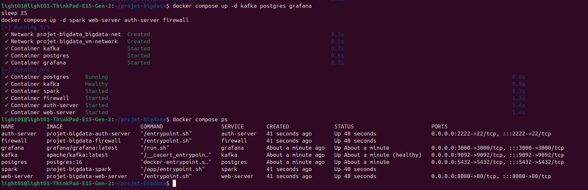

### Real Attack Simulation from Ubuntu Host
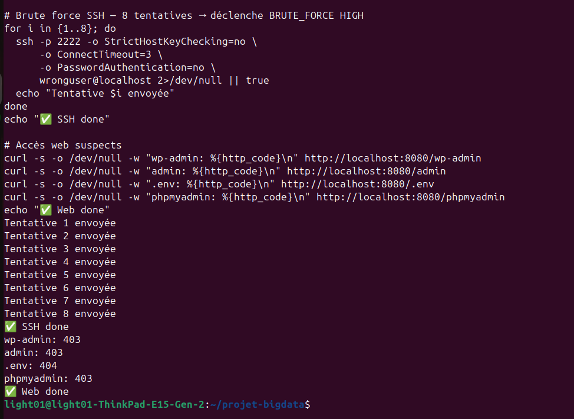

### Spark Detecting Anomalies in Real-Time
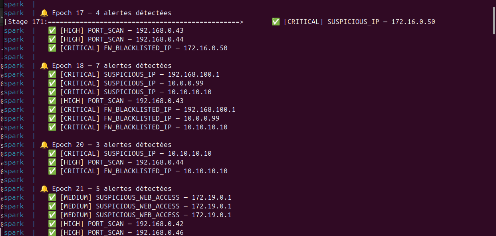

### Alerts Stored in PostgreSQL
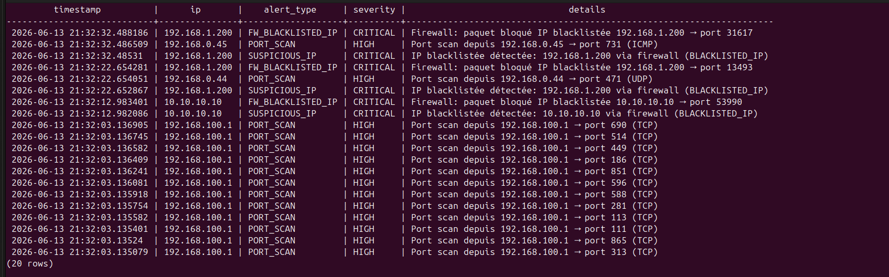

### Grafana — PostgreSQL Datasource Configuration
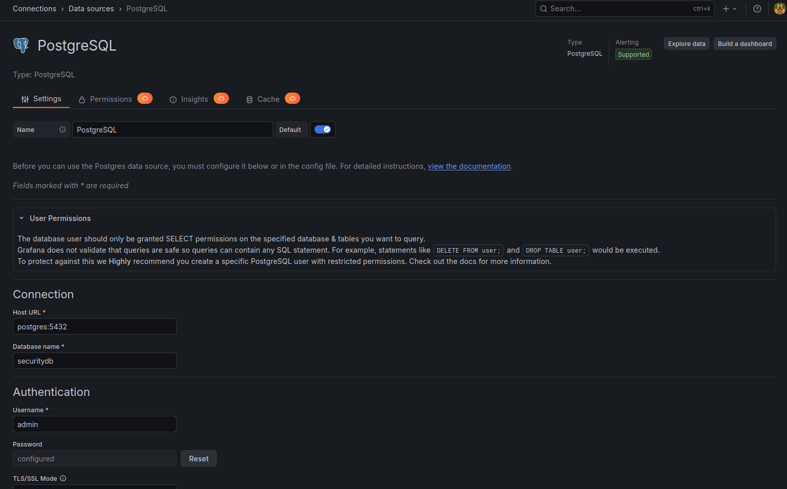

### Grafana — Live Alerts Table Panel
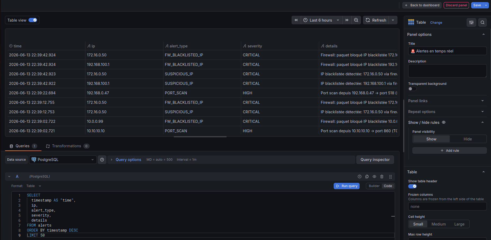

### Grafana — Alerts per Minute Time Series
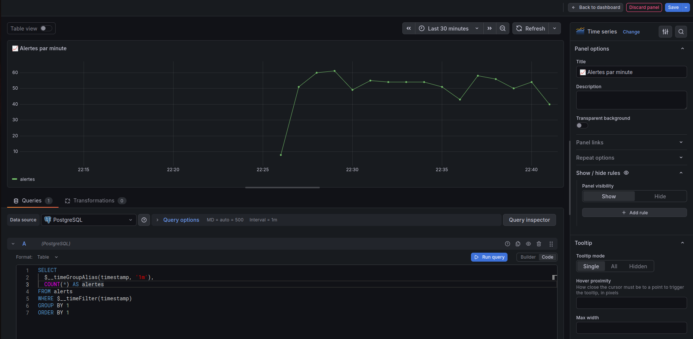

### Grafana — Severity Distribution Bar Chart
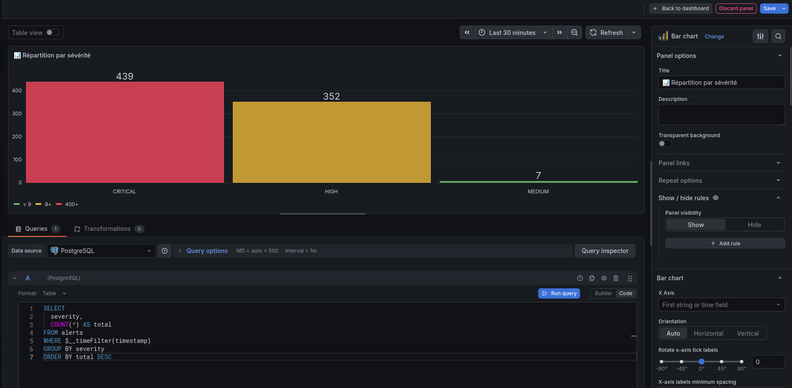

### Grafana — Full Security Monitoring Dashboard
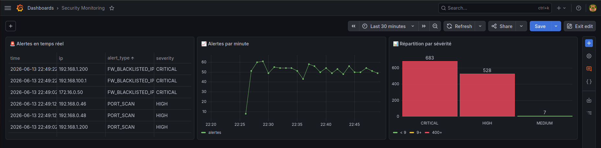

### Telegram Bot Setup with BotFather
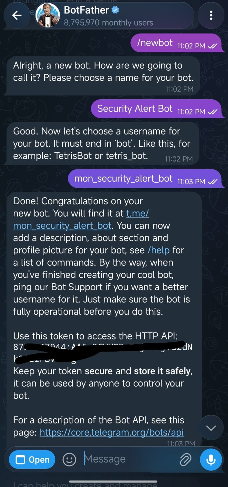

### Telegram Bot First Message Test
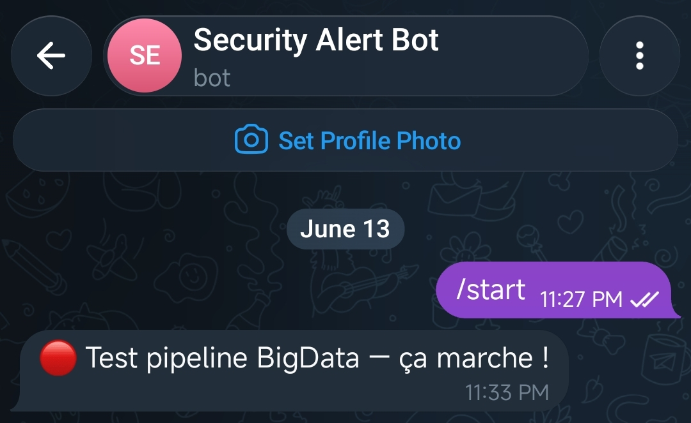

### Telegram — Real-Time Security Alerts Received
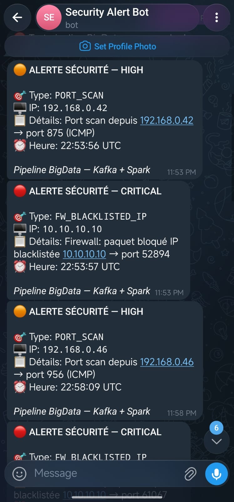

---

## 🚀 Quick Start

### Prerequisites

- Docker & Docker Compose installed
- Python 3 + `kafka-python` for the attack simulator
- ~4GB RAM available

```bash
pip3 install kafka-python
```

### 1. Clone the repository

```bash
git clone https://github.com/MdAmine05/projet-bigdata-spark.git
cd projet-bigdata-spark
```

### 2. Start the infrastructure

```bash
# Start core services first
docker compose up -d kafka postgres grafana
sleep 25

# Start processing + VM containers
docker compose up -d spark web-server auth-server firewall
```

### 3. Verify everything is running

```bash
docker compose ps
```

You should see 7 containers all with status `Up`.

### 4. Configure Grafana Dashboard

1. Open `http://localhost:3000` → login: `admin / admin`
2. Go to **Connections → Add new connection → PostgreSQL**
3. Fill in:
   - Host: `postgres:5432`
   - Database: `securitydb`
   - User: `admin` / Password: `secret`
   - TLS/SSL Mode: `disable`
4. Click **Save & Test**
5. Create a new dashboard with the 3 panels (see [Panel Queries](#panel-queries))

### 5. Configure Telegram (optional)

See [Telegram Alerts](#-telegram-alerts) section below.

---

## ⚔️ Simulating Attacks

### SSH Brute Force → BRUTE_FORCE (HIGH) → Telegram

```bash
for i in {1..8}; do
  ssh -p 2222 -o StrictHostKeyChecking=no \
      -o ConnectTimeout=3 \
      -o PasswordAuthentication=no \
      wronguser@localhost 2>/dev/null || true
  echo "Attempt $i sent"
done
```

### Suspicious Web Access → SUSPICIOUS_WEB_ACCESS (MEDIUM)

```bash
curl -s -o /dev/null -w "wp-admin: %{http_code}\n" http://localhost:8080/wp-admin
curl -s -o /dev/null -w "admin: %{http_code}\n" http://localhost:8080/admin
curl -s -o /dev/null -w ".env: %{http_code}\n" http://localhost:8080/.env
curl -s -o /dev/null -w "phpmyadmin: %{http_code}\n" http://localhost:8080/phpmyadmin
```

### Firewall Attacks → Interactive Menu

```bash
python3 trigger_attack.py
```

```
Choose attack type:
  1. Blacklisted IP (CRITICAL) → Telegram
  2. Port Scan (HIGH)          → Telegram
  3. Suspicious Port (MEDIUM)  → no Telegram
  4. All attacks
```

### Verify Alerts in PostgreSQL

```bash
docker exec -it postgres psql -U admin -d securitydb \
  -c "SELECT timestamp, ip, alert_type, severity FROM alerts ORDER BY timestamp DESC LIMIT 10;"
```

---

## 📱 Telegram Alerts

### Setup

1. Open Telegram → search **@BotFather** → `/newbot`
2. Get your **TOKEN** from BotFather
3. Message your bot → visit `https://api.telegram.org/botTOKEN/getUpdates` → get **CHAT_ID**
4. Update `spark/streaming.py`:

```python
TELEGRAM_TOKEN  = "your_token_here"
TELEGRAM_CHAT_ID = "your_chat_id_here"
```

5. Rebuild Spark:
```bash
docker compose build --no-cache spark
docker compose restart spark
```

### Alert Format

```
🔴 ALERTE SÉCURITÉ — CRITICAL

🎯 Type: FW_BLACKLISTED_IP
🖥️ IP: 10.0.0.99
📋 Détails: Firewall: paquet bloqué IP blacklistée 10.0.0.99
⏰ Heure: 22:53:57 UTC

Pipeline BigData — Kafka + Spark
```

Alerts are sent for **HIGH** and **CRITICAL** severity only to avoid noise.

---

## ⚙️ How It Works

### Data Flow — Step by Step

```
1. SOURCE
   web-server  → nginx writes /var/log/nginx/access.log
   auth-server → sshd writes /var/log/auth.log
   firewall    → generates network events

2. INGESTION (log_producer.py in each VM)
   tail -f log file
   → parse line with regex
   → build JSON event
   → KafkaProducer.send(topic, event)

3. STREAMING (Spark)
   readStream from Kafka (3 topics simultaneously)
   → from_json() decode each message
   → apply 6 detection rules
   → foreachBatch() every 10 seconds

4. STORAGE + ALERT
   → INSERT INTO alerts (PostgreSQL)
   → if severity in [HIGH, CRITICAL]: POST to Telegram API

5. VISUALIZATION
   Grafana queries PostgreSQL every 10s
   → updates 3 panels in real-time
```

### Kafka Topics

| Topic | Source | Events |
|---|---|---|
| `web-logs` | web-server nginx | HTTP 200/403/404 access events |
| `auth-logs` | auth-server sshd | SSH login success/failure events |
| `fw-logs` | firewall | Packet DROP/ACCEPT events |
| `security-events` | (legacy) | Original single-topic pipeline |

### Kafka Listener Configuration

```
PLAINTEXT_HOST://localhost:9092  ← Ubuntu host (trigger_attack.py)
PLAINTEXT://kafka:19092          ← Spark container (streaming.py)
CONTROLLER://kafka:29093         ← Kafka internal
```

This dual-listener setup is the key that allows both the host machine and internal containers to communicate with Kafka.

### Spark Micro-Batch Processing

```python
query = all_alerts.writeStream \
    .outputMode("update") \          # only emit changed rows
    .foreachBatch(write_to_postgres) \ # custom sink
    .trigger(processingTime="10 seconds") \  # batch every 10s
    .start()
```

`outputMode("update")` is required with aggregations — it only returns rows that changed since the last batch, making it efficient for windowed counts.

---

## 📊 Panel Queries (Grafana)

### Panel 1 — Live Alerts Table
```sql
SELECT timestamp AS "time", ip, alert_type, severity, details
FROM alerts
ORDER BY timestamp DESC
LIMIT 50
```

### Panel 2 — Alerts per Minute
```sql
SELECT $__timeGroupAlias(timestamp,'1m'), COUNT(*) AS alertes
FROM alerts
WHERE $__timeFilter(timestamp)
GROUP BY 1 ORDER BY 1
```

### Panel 3 — Severity Distribution
```sql
SELECT severity, COUNT(*) AS total
FROM alerts
WHERE $__timeFilter(timestamp)
GROUP BY severity
ORDER BY total DESC
```

---

## 🛑 Stop Everything

```bash
docker compose down
```

Images are cached — next startup is much faster.

---

## 🔄 Restart After Shutdown

```bash
cd projet-bigdata-spark
docker compose up -d kafka postgres grafana
sleep 25
docker compose up -d spark web-server auth-server firewall
```

> **Note:** Kafka topics are auto-created by `spark/entrypoint.sh` on every startup. No manual topic creation needed.

---

## 📝 Known Limitations

- Kafka stores topics in `/tmp` — they are recreated automatically on restart by the Spark entrypoint
- Grafana dashboard must be reconfigured if the `grafana-data` volume is deleted
- The `UNUSUAL_TIME` rule uses UTC time — adjust the hour range if your timezone differs
- iptables LOG inside Docker containers requires `nf_log_all_netns=1` on the host kernel for real packet logging

---

## 👤 Author

**Bazza Mohamed Amine**  
Master Sécurité IT & BigData  
Module : Architecture et Technologies BigData

---

<div align="center">

Built with ❤️ using Apache Kafka • Apache Spark • PostgreSQL • Grafana • Docker

</div>
